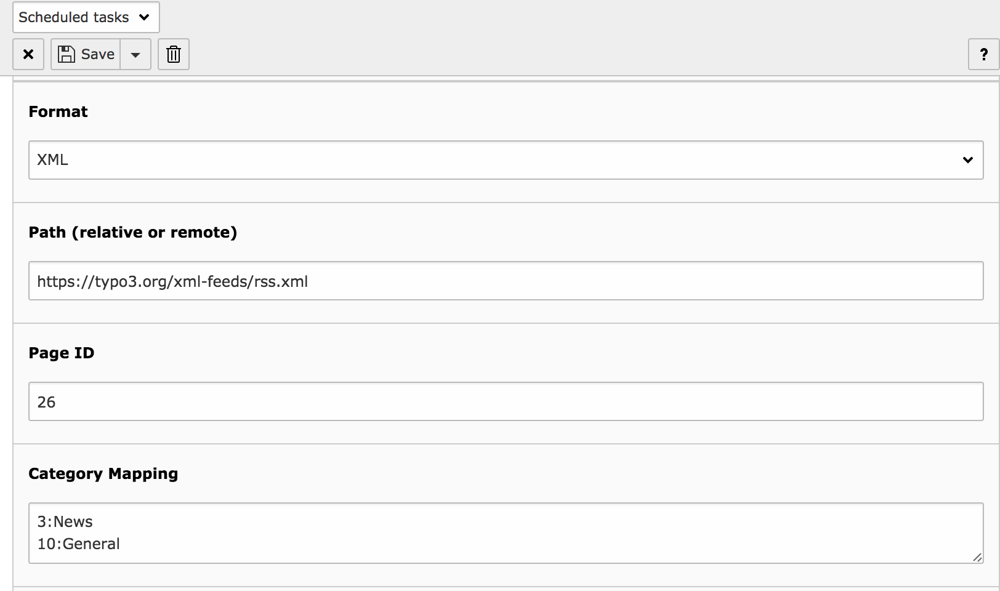
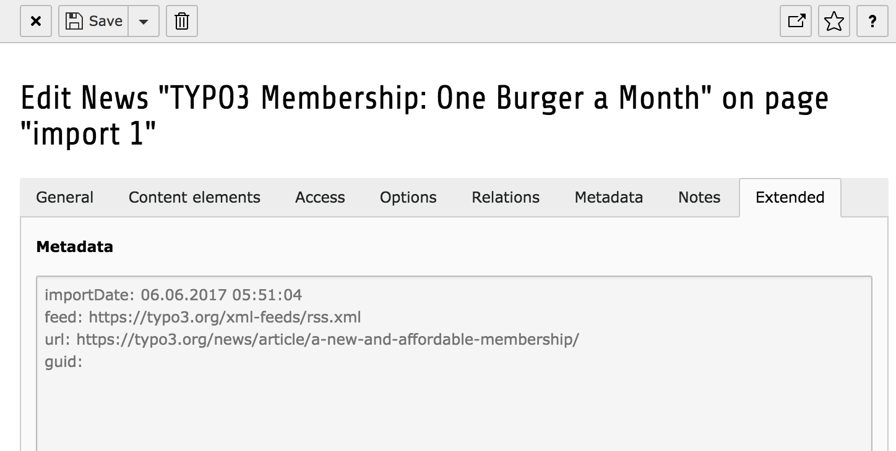

TYPO3 CMS Extension "news_importicsxml"
=======================================
This extensions provides an import interface for `xml` and `ics` files which can either be located on the same server or reached via URL.
The import is done by the scheduler.

**Requirements**

- TYPO3 CMS 7.6, 8.7 LTS
- EXT:news 6.0.0+

**Sponsors**

- TUM (Technical University of Munich) http://tum.de/
- Hochschule Darmstadt - University of Applied Sciences https://www.h-da.de/

Screenshots
^^^^^^^^^^^

**Screenshot #1:** Creation of an import task

**Screenshot #2:** Metadata of an imported item

Installation
------------

**Installation using Composer**

The recommended way to install the extension is by using composer. In your composer based TYPO3 project root, just do `composer require georgringer/news-importicsxml`.

**Installation as extension from TYPO3 Extension Repository (TER)**

Download and install the extension with the extension manager module.

Configuration
-------------
After installing the extension, switch to the module **scheduler** and create a new task **Import news**.
These additional fields are available:

Format
""""""
Select either *XML* or *ICS* to import an ICS file or an XML file.

Path
""""
Define a local path like `fileadmin/data.xml` or any URL like `https://typo3.org/xml-feeds/rss.xml`.

Page ID
"""""""
Define a page id where the new records will be saved.

Category mapping (XML only)
"""""""""""""""""""""""""""
A category mapping can be used to add categories to the news records based on categories found in the feed.

A typical feed item can look like this: ::

	<item>
		<title>A possible title</title>
		<link>http://www.examle.com/feed.xml</link>
		<description>Lorem ipsum</description>
		<content:encoded><![CDATA[A lot of text]]></content:encoded>
		<category>Sports</category>
		<category>Tech</category>
		<category>Information</category>
		<pubDate>Tue, 02 Jun 2015 16:54:00 +0200</pubDate>
	</item>

A possible category mapping would look like this: ::

	5:Sports
	17:Tech
	17:Information

As a result, the imported news record will belong to the categories of the IDs *5 & 17*.

Email notification
""""""""""""""""""
Add an email address which will get notified after each run.

**Important**: This feature is not yet implemented!

Further information
^^^^^^^^^^^^^^^^^^^

Debugging
---------
This extensions used the logging API of TYPO3 CMS. You can find some basic information in the log files (default `typo3temp/var/logs/typo3_****.log`).

Extending the import
--------------------
If you need to import additional data from a feed or ics item or you need to modify the data, use an aspect of the extension *news*.
Create a custom extension and adopt the code snippets to your needs:

*ext_localconf.php*: ::

	\TYPO3\CMS\Core\Utility\GeneralUtility::makeInstance('TYPO3\\CMS\\Extbase\\SignalSlot\\Dispatcher')->connect(
		'GeorgRinger\\News\\Domain\\Service\\NewsImportService',
		'postHydrate',
		'YourVendorName\\YourExtKey\\Aspect\\NewsImportAspect',
		'postHydrate'
	);

*typo3conf/ext/yourextkey/Classes/Aspect/NewsImportAspect.php*: ::

	<?php

	namespace YourVendorName\YourExtKey\Aspect;

	class NewsImportAspect {

		/**
		 * @param array $importData
		 * @param \GeorgRinger\News\Domain\Model\News $news
		 */
		public function postHydrate(array $importData, $news) {
			if (is_array($importData['_dynamicData'])) {
				// $importData['_dynamicData'] is filled with all data from the imported item
				if (isset($importData['_dynamicData']['location'])) {
					$news->setLocationSimple(trim($importData['_dynamicData']['location']));
				}
			}
		}
	}
